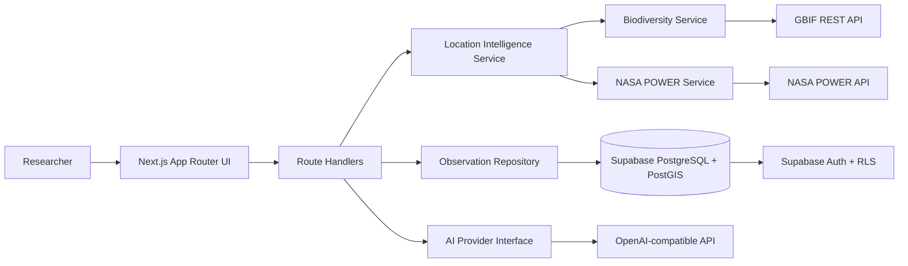
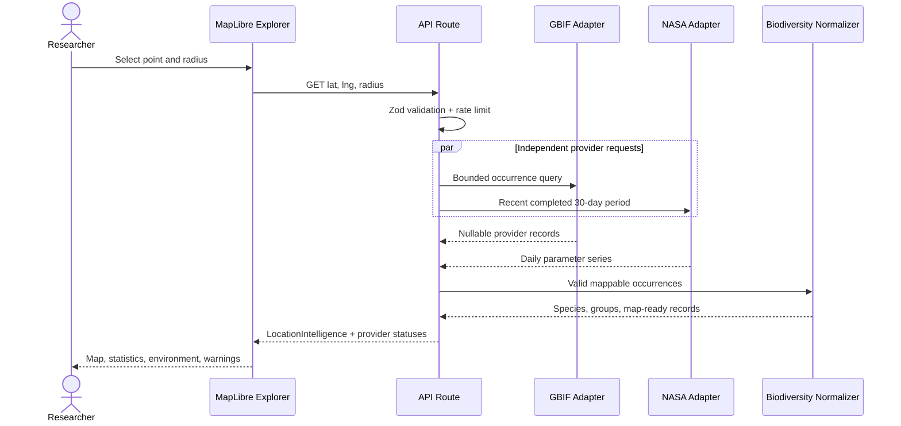
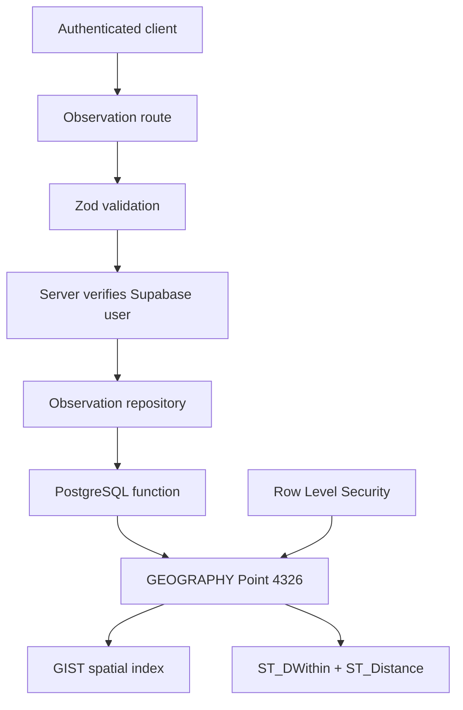

# BioScope architecture

BioScope is a modular Next.js application with explicit provider, normalization, repository, and presentation boundaries. The primary engineering challenge is integrating heterogeneous scientific datasets with different schemas and semantics. Provider-specific adapters convert those responses into the stable `LocationIntelligence` domain model before any data reaches React.

## System architecture



## Location intelligence data flow



`Promise.allSettled` deliberately preserves partial value: GBIF and NASA failures are independent. Each external request has a timeout. The API response records `ok`, `empty`, or `unavailable` status per provider and supplies a scientifically responsible warning.

## Spatial persistence and security



- The browser never supplies an authoritative `user_id`; route handlers derive it from `auth.getUser()`.
- RLS allows owners to mutate their records and allows public reads only when `is_public` is true.
- Coordinates are stored as `geography(point, 4326)`, which makes metric distance queries explicit and avoids naive JavaScript calculations.
- The repository calls narrow database functions and maps snake_case rows into domain objects.

## AI boundary

The `AIProvider` interface accepts a compact `FieldBriefInput`: location, aggregate counts, up to eight species summaries, taxonomic distribution, and normalized environment data. Raw occurrence arrays are excluded. The system instruction treats input strings as untrusted data, prohibits unsupported conservation claims, distinguishes record frequency from abundance, and requires bias disclosure. Without `AI_API_KEY`, the provider returns a visibly labeled deterministic demo summary rather than simulating an AI result.

## Caching and operational limits

- Next fetch caching: GBIF occurrence queries revalidate hourly, taxonomy daily, and NASA POWER every six hours.
- Provider calls time out after 8–10 seconds; AI calls after 20 seconds.
- At most 200 normalized GBIF records are returned and rendered; this remains below the observed Next fetch-cache item limit and MapLibre clusters the marker source.
- In-memory rate limiting provides per-instance prototype protection. A production multi-region deployment should use a shared Redis-compatible store.

## Error contract

All routes return safe errors in one envelope:

```json
{
  "error": {
    "code": "VALIDATION_ERROR",
    "message": "Latitude must be between -90 and 90."
  }
}
```

Provider response bodies and stack traces never cross the API boundary.
